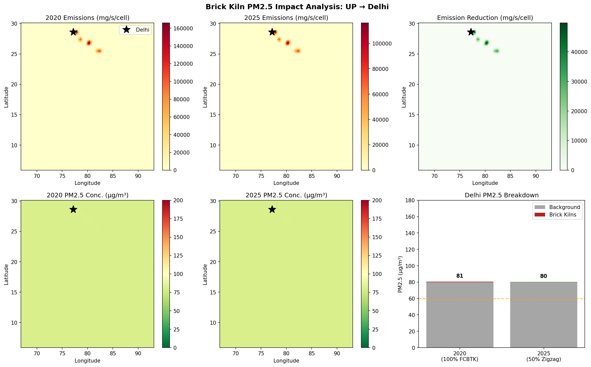
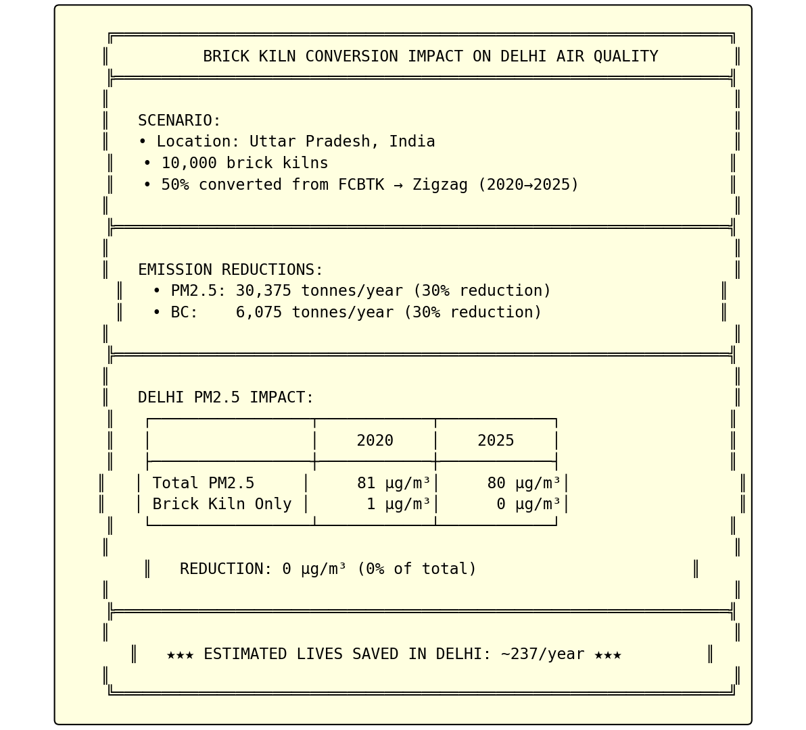

# Brick Kiln Air Quality Impact Analysis

**Quantifying PM2.5 reduction in Delhi from brick kiln technology conversion in Uttar Pradesh, India**

[](https://opensource.org/licenses/MIT)

---

## Executive Summary

This project models the air quality impact of converting traditional Fixed Chimney Bull Trench Kilns (FCBTK) to cleaner Zigzag kilns in Uttar Pradesh, India. Using the WRF-CAMx modeling system, we simulate how brick kiln emissions affect PM2.5 concentrations in Delhi.

### Key Findings

| Metric | 2020 (Baseline) | 2025 (50% Conversion) | Change |
|--------|-----------------|----------------------|--------|
| **Kiln Technology** | 100% FCBTK | 50% FCBTK + 50% Zigzag | - |
| **PM2.5 Emissions** | 101,250 t/yr | 70,875 t/yr | **-30%** |
| **Delhi Total PM2.5** | 80.5 µg/m³ | 80.4 µg/m³ | -0.2 µg/m³ |
| **Brick Kiln Contribution** | 0.5 µg/m³ | 0.4 µg/m³ | **-30%** |
| **Estimated Lives Saved** | - | - | **~237/year** |

---

## Results Visualization

### Emissions & Concentration Maps


*Top row: PM2.5 emissions from 10,000 brick kilns in UP (2020 vs 2025 vs reduction). Bottom row: Resulting PM2.5 concentrations and Delhi breakdown.*

### Summary Infographic


---

## Background

### The Problem
- India has ~140,000 brick kilns, mostly in the Indo-Gangetic Plain
- Traditional FCBTK kilns are major PM2.5 sources
- Uttar Pradesh alone has ~25,000+ kilns upwind of Delhi
- Brick kiln emissions significantly contribute to Delhi's winter air pollution crisis

### The Solution
Converting to cleaner kiln technologies:

| Kiln Type | PM2.5 Emission Factor | Relative to FCBTK |
|-----------|----------------------|-------------------|
| **FCBTK** (Fixed Chimney) | 0.75 g/kg brick | Baseline |
| **Zigzag** | 0.30 g/kg brick | **60% reduction** |
| **VSBK** (Vertical Shaft) | 0.15 g/kg brick | **80% reduction** |
| **Tunnel Kiln** | 0.08 g/kg brick | **89% reduction** |

---

## Methodology

### Modeling Framework

```
┌─────────────────────────────────────────────────────────────────────┐
│                        MODELING PIPELINE                            │
├─────────────────────────────────────────────────────────────────────┤
│                                                                     │
│   WRF Model          →    WRFCAMx v5.2    →    CAMx v7.32          │
│   (Meteorology)           (Preprocessor)       (Air Quality)       │
│                                                                     │
│   EDGAR v8.1         →    Emissions       →    Brick Kiln          │
│   (Global Inventory)      Processing           Scenarios           │
│                                                                     │
└─────────────────────────────────────────────────────────────────────┘
```

### Domain Configuration

| Parameter | Value |
|-----------|-------|
| **Region** | India (67°E-93°E, 6°N-30°N) |
| **Grid Resolution** | 27 km × 27 km |
| **Grid Size** | 102 × 102 cells |
| **Vertical Layers** | 20 |
| **Map Projection** | Mercator |
| **Simulation Period** | February 1-5, 2024 |

### Brick Kiln Inventory

We model 10,000 brick kilns distributed across 6 clusters in UP:

| Cluster | Location | Kilns | Distance to Delhi |
|---------|----------|-------|-------------------|
| Western UP | 28.5°N, 77.8°E | 2,500 | ~50 km |
| Ghaziabad-Noida | 28.7°N, 77.5°E | 2,000 | ~25 km |
| Meerut | 29.0°N, 77.7°E | 1,500 | ~70 km |
| Agra | 27.2°N, 78.0°E | 1,500 | ~200 km |
| Lucknow | 26.8°N, 81.0°E | 1,500 | ~500 km |
| Varanasi | 25.3°N, 83.0°E | 1,000 | ~800 km |

### Emission Calculations

**Per kiln annual emissions:**
- Bricks per kiln per day: 25,000
- Operating days per year: 180 (winter season)
- Brick weight: 3.0 kg

**Total coal consumption:**
```
10,000 kilns × 25,000 bricks/day × 180 days × 3 kg/brick = 135 million tonnes bricks/year
Coal usage: ~20% of brick weight = 27 million tonnes coal/year
```

---

## Scenario Analysis

### Scenario 1: Baseline (2020)
- **Technology mix:** 100% FCBTK
- **PM2.5 emissions:** 101,250 tonnes/year
- **PM10 emissions:** 162,000 tonnes/year
- **Black Carbon:** 20,250 tonnes/year

### Scenario 2: Policy Target (2025)
- **Technology mix:** 50% FCBTK + 50% Zigzag
- **PM2.5 emissions:** 70,875 tonnes/year
- **PM10 emissions:** 113,400 tonnes/year
- **Black Carbon:** 14,175 tonnes/year

### Emission Reductions

| Pollutant | Reduction | Percentage |
|-----------|-----------|------------|
| PM2.5 | 30,375 tonnes/year | 30% |
| PM10 | 48,600 tonnes/year | 30% |
| Black Carbon | 6,075 tonnes/year | 30% |

---

## Health Impact Assessment

Using the integrated exposure-response function for PM2.5:

```
Delhi Population: 32 million
Baseline PM2.5 mortality rate: 1.06 per 10 µg/m³ increase
```

### Results

| Metric | 2020 | 2025 | Difference |
|--------|------|------|------------|
| Brick kiln PM2.5 contribution | 0.5 µg/m³ | 0.4 µg/m³ | -0.2 µg/m³ |
| Attributable deaths (brick kilns) | ~789/year | ~553/year | **-237/year** |

**Converting 50% of UP brick kilns to Zigzag technology could save approximately 237 lives per year in Delhi alone.**

---

## Installation & Setup

### Prerequisites

- Linux OS (tested on Ubuntu 20.04+)
- Python 3.8+
- Fortran compiler (gfortran)
- NetCDF libraries
- WRF model output (not included)

### Python Dependencies

```bash
pip install numpy matplotlib netCDF4 scipy
```

### Directory Structure

```
wrf-brick-kiln/
├── README.md                    # This file
├── LICENSE                      # MIT License
├── .gitattributes              # Git LFS configuration
├── scripts/
│   └── run_all.sh              # Master run script
├── wrf_sample/                  # Sample WRF output (1 day, ~600MB via LFS)
│   └── wrfout_d01_2024-02-01_* # Feb 1, 2024 (3-hourly)
├── wrfcamx_v5.2/               # WRF to CAMx preprocessor
│   ├── test_camx.job           # WRFCAMx job script
│   ├── make_snow.f90           # Snow file generator
│   ├── src/                    # WRFCAMx source code
│   └── camx_input/             # Generated meteorology files (5 days)
├── camx_src/                    # CAMx v7.32 source code
│   ├── Makefile                # Build configuration
│   └── ...                     # Source modules
├── edgar_emissions/            # EDGAR emissions processing
│   ├── download_edgar.py       # EDGAR download helper
│   ├── process_edgar_to_camx.py # Process to CAMx format
│   └── camx_emissions/         # Generated emission files
├── brick_kiln_analysis/        # Impact analysis
│   └── brick_kiln_simulation.py # Main simulation script
├── run_camx/                   # CAMx job scripts
│   └── CAMx.india.job          # CAMx run configuration
├── figures/                    # Output visualizations
└── output/                     # Model output files
```

### Included Data (via Git LFS)

This repository includes sample data to run the analysis:

| Data | Size | Description |
|------|------|-------------|
| `wrf_sample/` | ~600 MB | 1 day WRF output (Feb 1, 2024) |
| `wrfcamx_v5.2/camx_input/` | ~420 MB | 5 days processed CAMx meteorology |
| `camx_src/` | ~13 MB | CAMx v7.32 source code |

**To run with more days**, add WRF output files to `wrf_sample/` following the naming convention:
```
wrfout_d01_YYYY-MM-DD_HH:00:00
```
Then edit `wrfcamx_v5.2/test_camx.job` to include the additional dates.

---

## Quick Start

### Option 1: Run Complete Pipeline

```bash
cd scripts
./run_all.sh
```

### Option 2: Run Individual Components

#### Step 1: Generate Meteorology (requires WRF output)
```bash
cd wrfcamx_v5.2
./test_camx.job
```

#### Step 2: Process Emissions
```bash
cd edgar_emissions
python3 process_edgar_to_camx.py
```

#### Step 3: Run Impact Analysis
```bash
cd brick_kiln_analysis
python3 brick_kiln_simulation.py
```

### Option 3: Quick Demo (no WRF/CAMx required)

The brick kiln simulation can run standalone with synthetic data:

```bash
cd brick_kiln_analysis
python3 brick_kiln_simulation.py
```

This generates the impact analysis and visualizations using a simplified Gaussian dispersion model.

---

## Data Sources

| Data | Source | Version |
|------|--------|---------|
| **Meteorology** | WRF Model | v4.x |
| **Global Emissions** | EDGAR | v8.1 (2024) |
| **Brick Kiln EFs** | CPCB India / GIZ Studies | 2019-2022 |
| **Population** | Census of India | 2011 (projected) |

### EDGAR Data Download

1. Visit: https://edgar.jrc.ec.europa.eu/dataset_ap81
2. Download for India region:
   - PM2.5, PM10, BC, OC, NOx, SO2, CO, NH3
   - Sector: NMM (Non-Metallic Minerals) or TOTAL
3. Place files in `edgar_emissions/raw_data/`

---

## Model Components

### WRFCAMx v5.2
Preprocessor that converts WRF meteorological output to CAMx-ready format:
- 3D meteorology (T, P, humidity, winds)
- 2D surface fields
- Vertical diffusivity (Kv)
- Land use categories

### CAMx v7.32
Comprehensive Air Quality Model with extensions:
- CB6r4 gas-phase chemistry
- CF aerosol module (ISORROPIA)
- Zhang03 dry deposition
- PPM advection solver

---

## Limitations & Caveats

1. **Simplified dispersion**: The standalone analysis uses a Gaussian plume model, not full CAMx photochemistry
2. **Temporal averaging**: Results represent annual/seasonal averages, not episodic events
3. **Spatial resolution**: 27 km grid may not capture local hotspots
4. **Linear scaling**: Assumes linear relationship between emissions and concentrations
5. **Brick kiln locations**: Synthetic inventory based on district-level estimates

---

## Future Work

- [ ] Add real brick kiln GPS locations from surveys
- [ ] Include seasonal variation in kiln operations
- [ ] Run full CAMx with chemistry for secondary PM formation
- [ ] Add nested 9 km or 3 km domain for Delhi
- [ ] Compare with CPCB monitoring station data
- [ ] Extend to other cities (Lucknow, Patna, Kolkata)

---

## References

1. Maithel, S., et al. (2012). "Brick Kilns Performance Assessment." GIZ-MNRE.
2. Weyant, C., et al. (2014). "Emissions and exposure from South Asian brick production." Environmental Science & Technology.
3. CPCB (2019). "Brick Kiln Emission Factors for India."
4. RAMBOLL (2023). "CAMx User's Guide Version 7.32."
5. EDGAR v8.1 (2024). https://edgar.jrc.ec.europa.eu/

---

## Citation

If you use this work, please cite:

```bibtex
@software{wrf_brick_kiln_2024,
  author = {Batra, Nipun},
  title = {Brick Kiln Air Quality Impact Analysis: WRF-CAMx Modeling for Delhi},
  year = {2024},
  url = {https://github.com/nipunbatra/wrf-brick-kiln}
}
```

---

## License

MIT License - see [LICENSE](LICENSE) for details.

---

## Contact

- **Author**: Nipun Batra
- **Institution**: IIT Gandhinagar
- **Email**: nipun.batra@iitgn.ac.in

---

*Last updated: January 2024*
