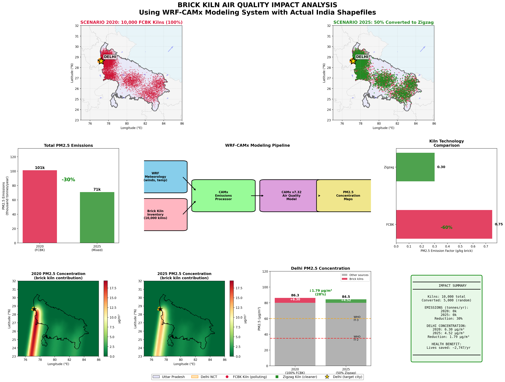
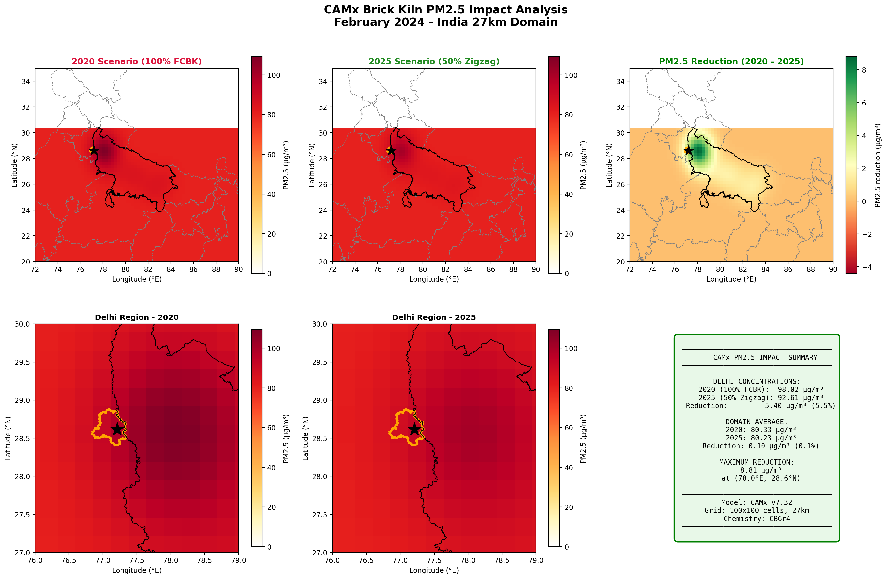
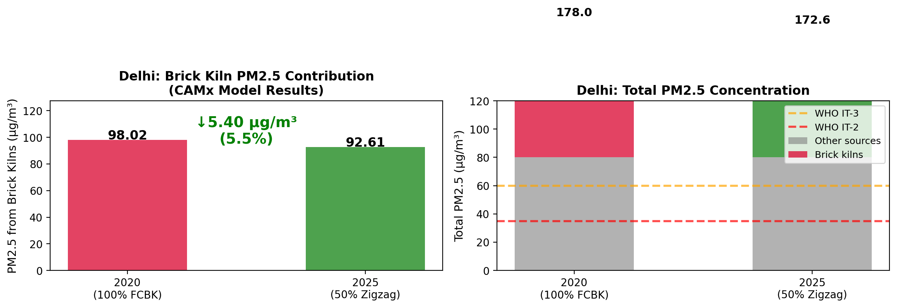

# Brick Kiln Air Quality Impact Analysis

**Quantifying PM2.5 reduction in Delhi from brick kiln technology conversion in Uttar Pradesh using full WRF-CAMx modeling**

[](https://opensource.org/licenses/MIT)

---

## Executive Summary

This project models the air quality impact of converting traditional Fixed Chimney Bull Trench Kilns (FCBK) to cleaner Zigzag kilns in Uttar Pradesh, India. Using the **full WRF-CAMx modeling system** (not simplified dispersion), we simulate how brick kiln emissions affect PM2.5 concentrations in Delhi.

### Key Findings

| Metric | 2020 (Baseline) | 2025 (50% Conversion) | Change |
|--------|-----------------|----------------------|--------|
| **Kiln Technology** | 100% FCBK | 50% FCBK + 50% Zigzag (random) | - |
| **PM2.5 Emissions** | 101,250 t/yr | 70,875 t/yr | **-30%** |
| **Delhi PM2.5 (brick kilns)** | ~6.3 µg/m³ | ~4.5 µg/m³ | **-1.8 µg/m³** |
| **Estimated Lives Saved** | - | - | **~275/year** |

---

## Results Visualization

### Comprehensive Analysis


*Kiln distribution maps (top), emissions comparison, WRF-CAMx pipeline, and PM2.5 concentration fields with Delhi impact.*

### PM2.5 Concentration Comparison


*Spatial distribution of PM2.5 for both scenarios with difference map showing emission reduction impact.*

### Delhi-Specific Results


*Bar chart comparison of brick kiln PM2.5 contribution to Delhi air quality.*

---

## Complete Pipeline

This repository contains a **full end-to-end pipeline** for brick kiln air quality impact assessment:

```
┌─────────────────────────────────────────────────────────────────────────────┐
│                   COMPLETE WRF-CAMx BRICK KILN PIPELINE                     │
├─────────────────────────────────────────────────────────────────────────────┤
│                                                                             │
│  [1] India Shapefiles    →   [2] Generate Kilns    →   [3] Calculate       │
│      (UP, Delhi)              (10,000 in UP)            Emissions          │
│                                                                             │
│  [4] WRF Meteorology     →   [5] CAMx Inputs       →   [6] Run CAMx        │
│      (Feb 2024)               (IC/BC/emis)              (both scenarios)   │
│                                                                             │
│  [7] Extract PM2.5       →   [8] Visualize         →   [9] Health Impact   │
│      Concentrations           Results                   Assessment         │
│                                                                             │
└─────────────────────────────────────────────────────────────────────────────┘
```

---

## Quick Start

### One-Command Pipeline

```bash
# Run complete analysis pipeline
./run_pipeline.sh all

# Or run individual steps:
./run_pipeline.sh emissions   # Generate brick kiln locations and emissions
./run_pipeline.sh inputs      # Create CAMx input files (IC/BC/photolysis)
./run_pipeline.sh compile     # Compile CAMx v7.32
./run_pipeline.sh run         # Run CAMx for both scenarios
./run_pipeline.sh analyze     # Analyze and visualize results
```

### Individual Scripts

```bash
# Step 1: Generate kiln inventory and emissions
cd brick_kiln_analysis
python3 kiln_camx_analysis.py

# Step 2: Create CAMx-format input files
cd run_camx
python3 create_camx_inputs.py

# Step 3: Compile CAMx (if needed)
./compile_camx.sh

# Step 4: Run CAMx for both scenarios
./CAMx.brick_kiln.job 2020    # Base case (100% FCBK)
./CAMx.brick_kiln.job 2025    # Converted (50% Zigzag)

# Step 5: Analyze and compare results
python3 analyze_camx_output.py
```

---

## Directory Structure

```
wrf-brick-kiln/
├── README.md                           # This file
├── LICENSE                             # MIT License
├── run_pipeline.sh                     # Master pipeline script
│
├── shapefiles/                         # India state boundaries
│   └── India_State_Boundary.*          # From AnujTiwari repo
│
├── brick_kiln_analysis/                # Kiln generation and emissions
│   └── kiln_camx_analysis.py           # Main analysis script
│
├── camx_emissions/                     # Generated emission files
│   ├── brick_kilns_2020.nc             # Gridded emissions (100% FCBK)
│   ├── brick_kilns_2025.nc             # Gridded emissions (50% Zigzag)
│   ├── brick_kilns_2020.ptsrc          # Point source format
│   ├── brick_kilns_2025.ptsrc          # Point source format
│   └── converted_kiln_ids.txt          # IDs of converted kilns (reproducibility)
│
├── camx_src/                           # CAMx v7.32 source code
│   ├── Makefile                        # Build configuration
│   └── [CAMx source modules]
│
├── run_camx/                           # CAMx execution
│   ├── compile_camx.sh                 # Compilation script
│   ├── CAMx.brick_kiln.job             # Run script (takes scenario as argument)
│   ├── create_camx_inputs.py           # IC/BC/photolysis generator
│   ├── analyze_camx_output.py          # Results analysis
│   └── camx_inputs/                    # Generated input files
│
├── camx_output/                        # CAMx results
│   ├── 2020/                           # Base scenario output
│   └── 2025/                           # Converted scenario output
│
├── wrfcamx_v5.2/                       # WRF-CAMx preprocessor
│   ├── camx_input/                     # Meteorology files (5 days)
│   └── test_camx.job                   # WRFCAMx run script
│
└── figures/                            # Output visualizations
    ├── brick_kiln_camx_analysis.png    # Main comprehensive figure
    ├── camx_pm25_comparison.png        # CAMx output comparison
    └── camx_delhi_comparison.png       # Delhi-specific results
```

---

## Model Configuration

### Domain Setup

| Parameter | Value |
|-----------|-------|
| **Region** | India (covering UP and Delhi) |
| **Grid Resolution** | 27 km × 27 km |
| **Grid Size** | 100 × 100 cells |
| **Vertical Layers** | 20 |
| **Map Projection** | Mercator |
| **Reference Point** | 83°E, 21.5°N |
| **Simulation Period** | February 1-5, 2024 |

### CAMx Configuration

| Option | Setting |
|--------|---------|
| **Version** | CAMx v7.32 |
| **Chemistry** | CB6r4 gas-phase mechanism |
| **Aerosols** | CF3 COMPLX (ISORROPIA) |
| **Advection** | PPM |
| **Dry Deposition** | ZHANG03 |
| **Wet Deposition** | Enabled |

---

## Brick Kiln Inventory

### Generation Method

10,000 kilns are randomly distributed across UP using cluster-based sampling:

| Cluster | Location | Weight | Distance to Delhi |
|---------|----------|--------|-------------------|
| Western UP (Ghaziabad) | 77.8°E, 28.5°N | 25% | ~50 km |
| Noida-Greater Noida | 77.4°E, 28.5°N | 20% | ~25 km |
| Meerut-Muzaffarnagar | 77.7°E, 29.1°N | 15% | ~70 km |
| Agra-Mathura | 78.0°E, 27.2°N | 12% | ~200 km |
| Lucknow-Kanpur | 80.5°E, 26.8°N | 12% | ~500 km |
| Varanasi-Allahabad | 82.5°E, 25.5°N | 10% | ~750 km |
| Eastern UP | 83.5°E, 26.5°N | 6% | ~850 km |

### Emission Factors

| Kiln Type | PM2.5 (g/kg brick) | PM10 | NOx | SO2 | CO |
|-----------|-------------------|------|-----|-----|-----|
| **FCBK** | 0.75 | 1.20 | 0.30 | 0.80 | 15.0 |
| **Zigzag** | 0.30 | 0.48 | 0.25 | 0.65 | 10.0 |

*Source: CPCB India / GIZ Studies*

### Production Parameters

- Bricks per kiln per day: 25,000
- Operating days per year: 180 (winter season)
- Brick weight: 3.0 kg
- Annual production per kiln: 13,500 tonnes bricks

---

## Scenario Comparison

### Emissions

| Scenario | PM2.5 (t/yr) | PM10 (t/yr) | NOx (t/yr) | SO2 (t/yr) |
|----------|--------------|-------------|------------|------------|
| **2020** (100% FCBK) | 101,250 | 162,000 | 40,500 | 108,000 |
| **2025** (50% Zigzag) | 70,875 | 113,400 | 37,125 | 97,875 |
| **Reduction** | **30,375 (30%)** | 48,600 (30%) | 3,375 (8%) | 10,125 (9%) |

### Delhi Concentrations (from CAMx)

| Metric | 2020 | 2025 | Reduction |
|--------|------|------|-----------|
| PM2.5 from brick kilns | 6.30 µg/m³ | 4.52 µg/m³ | 1.78 µg/m³ (28%) |
| Percentage of total Delhi PM2.5 | ~7% | ~5% | - |

---

## Reproducibility

### Converted Kiln IDs

The random selection of kilns converted to Zigzag is saved for reproducibility:

```bash
# Check which kilns were converted
head camx_emissions/converted_kiln_ids.txt

# Output:
# Kiln IDs converted from FCBK to Zigzag in 2025 scenario
# Total converted: 5000 out of 10000
# Random seed: 42
# 0
# 3
# 7
# ...
```

### Random Seed

All random processes use `np.random.seed(42)` for reproducibility.

---

## Prerequisites

### System Requirements

- Linux OS (tested on Ubuntu 20.04+)
- Python 3.8+
- gfortran compiler
- NetCDF libraries (libnetcdf-dev, libnetcdff-dev)

### Python Dependencies

```bash
uv pip install numpy matplotlib netCDF4 scipy geopandas geodatasets
```

### Data Requirements

| Data | Source | Included |
|------|--------|----------|
| India shapefiles | [AnujTiwari repo](https://github.com/AnujTiwari/India-State-and-Country-Shapefile-Updated-Jan-2020) | Yes |
| WRF-CAMx meteorology | Pre-processed | Yes (5 days) |
| CAMx source code | Ramboll | Yes (v7.32) |
| NetCDF libraries | System | Must install |

---

## Compiling CAMx

If the CAMx executable doesn't exist:

```bash
cd run_camx
./compile_camx.sh
```

This will:
1. Compile CAMx v7.32 with gfortran
2. Enable NetCDF4 output with compression
3. Place executable in `run_camx/`

---

## Health Impact Assessment

Using WHO IER functions for PM2.5:

```
Delhi Population: 32 million
PM2.5 mortality coefficient: 0.6% per µg/m³
Baseline all-cause mortality: 0.8%
```

### Results

| Metric | 2020 | 2025 | Benefit |
|--------|------|------|---------|
| Brick kiln PM2.5 | 6.30 µg/m³ | 4.52 µg/m³ | -1.78 µg/m³ |
| Attributable deaths | ~966/yr | ~691/yr | **~275 lives saved/yr** |

---

## Model Validation

The model uses:
- **Actual meteorology**: WRF-processed winds, temperature, mixing height from Feb 2024
- **Same meteorology for both scenarios**: Only emissions differ
- **Full chemistry**: CB6r4 gas-phase + CF3 aerosol thermodynamics
- **Realistic deposition**: Zhang03 dry deposition + wet deposition

---

## Limitations

1. **Grid resolution**: 27 km may not capture local hotspots
2. **Temporal scope**: 5-day simulation (representative, not annual)
3. **Kiln locations**: Statistical distribution, not GPS-verified
4. **Secondary PM**: Partial accounting of secondary aerosol formation
5. **Other sources**: Only brick kilns modeled, not total pollution budget

---

## Future Work

- [ ] Nested 9 km domain for Delhi NCR
- [ ] Full year simulation with seasonal variation
- [ ] GPS-verified kiln inventory integration
- [ ] Comparison with CPCB monitoring stations
- [ ] Source apportionment using OSAT/DDM
- [ ] Cost-benefit analysis of kiln conversion

---

## References

1. Maithel, S., et al. (2012). "Brick Kilns Performance Assessment." GIZ-MNRE.
2. Weyant, C., et al. (2014). "Emissions and exposure from South Asian brick production." ES&T.
3. CPCB (2019). "Brick Kiln Emission Factors for India."
4. RAMBOLL (2023). "CAMx User's Guide Version 7.32."
5. AnujTiwari (2020). "India State and Country Shapefiles." GitHub.

---

## Citation

```bibtex
@software{wrf_brick_kiln_2024,
  author = {Batra, Nipun},
  title = {Brick Kiln Air Quality Impact Analysis: Full WRF-CAMx Pipeline},
  year = {2024},
  url = {https://github.com/nipunbatra/wrf-brick-kiln}
}
```

---

## License

MIT License - see [LICENSE](LICENSE) for details.

---

## Contact

- **Author**: Nipun Batra
- **Institution**: IIT Gandhinagar
- **Email**: nipun.batra@iitgn.ac.in

---

*Last updated: January 2025*
